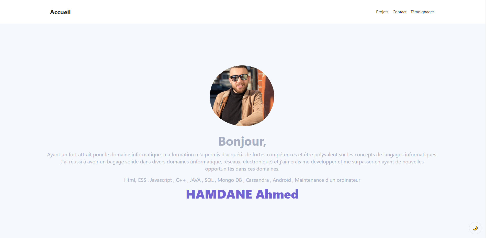
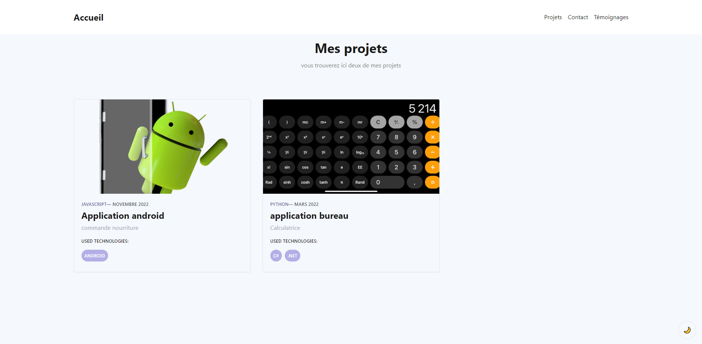
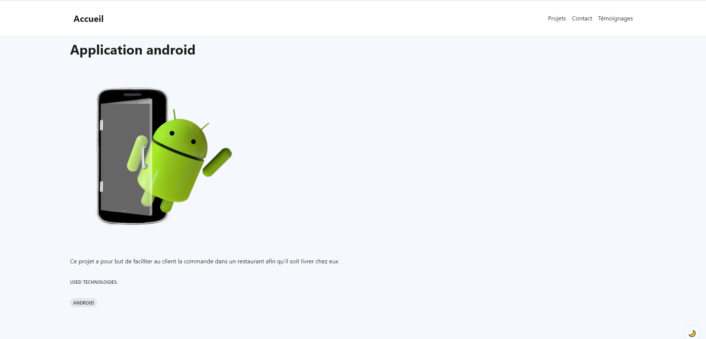
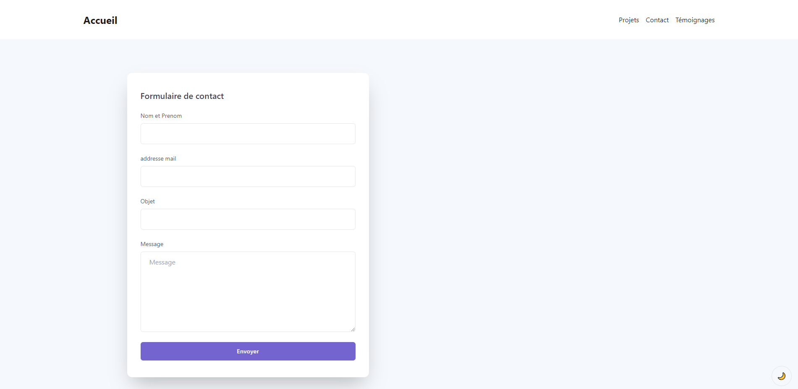
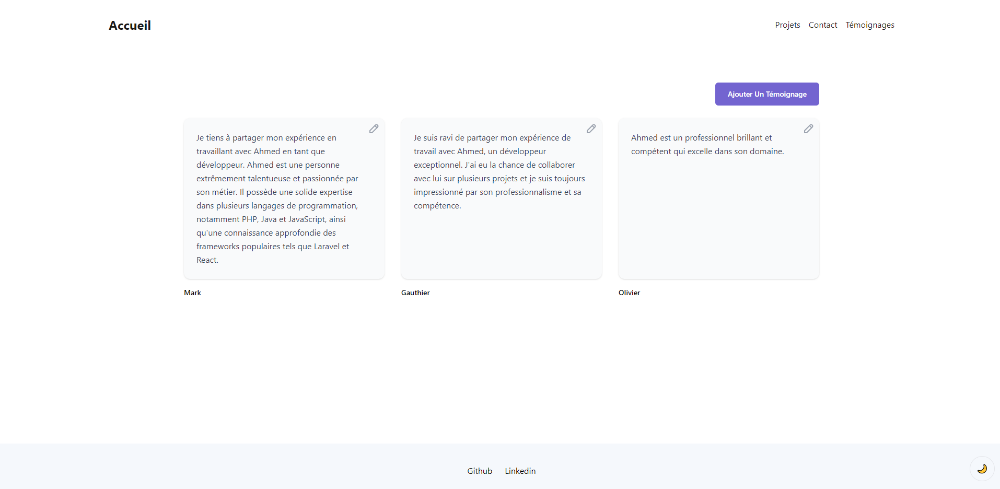
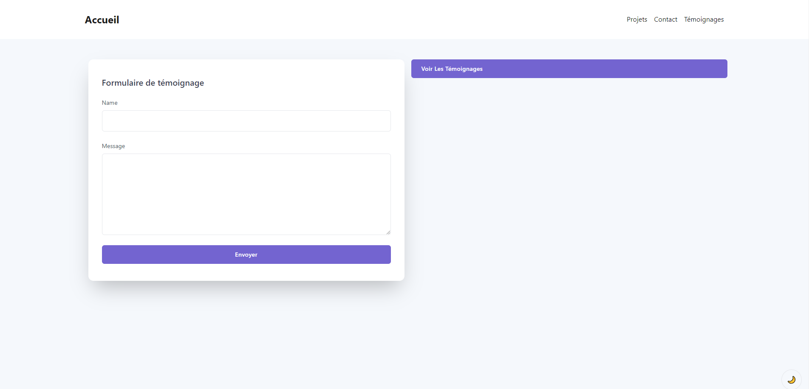

# Mon Portfolio

Bienvenue sur mon portfolio ! Ce projet a été créé avec [Create React App](https://github.com/facebook/create-react-app) et utilise [Tailwind CSS ](https://tailwindcss.com/) pour les styles, ainsi que [React Router](https://reactrouter.com/) pour la navigation.

## Prérequis

Avant de démarrer l'application, assurez-vous d'avoir installé les dépendances nécessaires en exécutant la commande suivante :

### `npm install`

## Démarrage

Pour démarrer l'application, exécutez la commande suivante :

### `npm start`

## Construction (Build)

Si vous souhaitez créer une version optimisée de l'application pour la production, exécutez la commande suivante :

### `npm run build`

Dans la barre de navigation située en haut de la page, vous trouverez les boutons suivants :

- **Accueil** : Vous ramène à la page d'accueil.
  
- **Projets** : Vous permet de découvrir deux de mes projets précédents. Vous pouvez cliquer sur l'un d'eux pour obtenir plus de détails.
  
  
- **Contact** : Vous amène à une page où vous pouvez m'envoyer un message en remplissant votre nom et votre message, ainsi que d'autres informations facultatives.
  
- **Témoignages** : Vous permet de lire les avis des personnes ayant utilisé ma plateforme. Vous pouvez également laisser votre propre témoignage en cliquant sur le bouton "Ajouter un témoignage".
  
  
  Dans le footer vous trouverez les lien:

- **GitHub** : Vous redirige vers mon profil GitHub.
- **LinkedIn** : Vous redirige vers mon profil LinkedIn.
